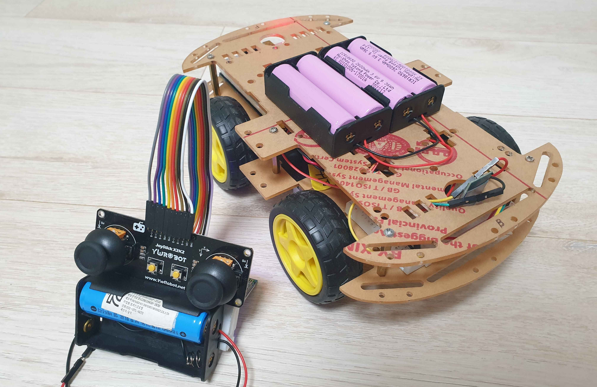
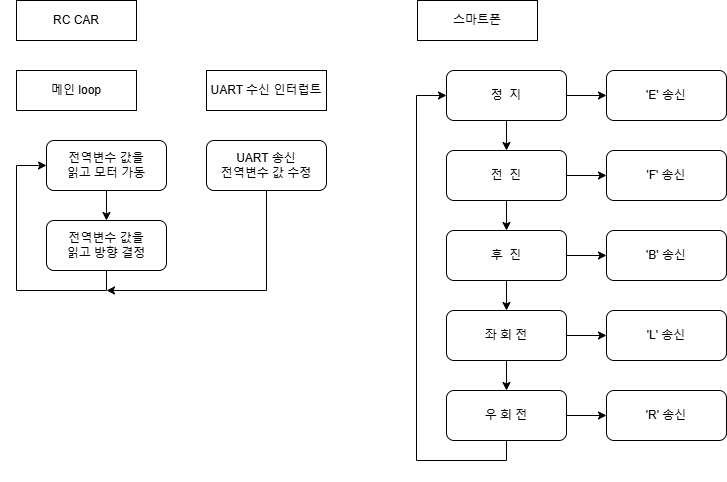
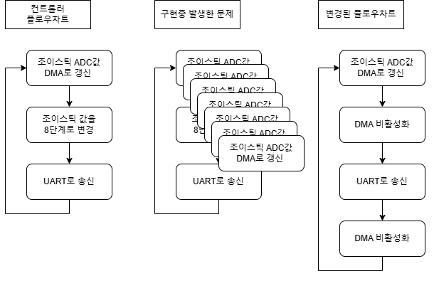

# 자율주행 RC CAR

## 사용 프리패럴

- STM32
  - RC카 본체용 : STM32F411RET6
  - 컨트롤러 용 : SMT32F103C8T6

- 스마트폰
  - 스마트폰 어플과 블루투스를 이용하여 RC카 원격 제어

- 블루투스 모듈
  - HC-06를 이용하여 RC카 원격 제어
  - 마스터 - 슬레이브간 통신

## 프로젝트 내용

### 1차 프로젝트 - RC CAR + 스마트폰

### 2차 프로젝트 - RC CAR + 조이스틱 컨트롤러러

## 교착점 및 해결방법

### 1. DMA값 갱신 문제

조이스틱값을 읽는 

